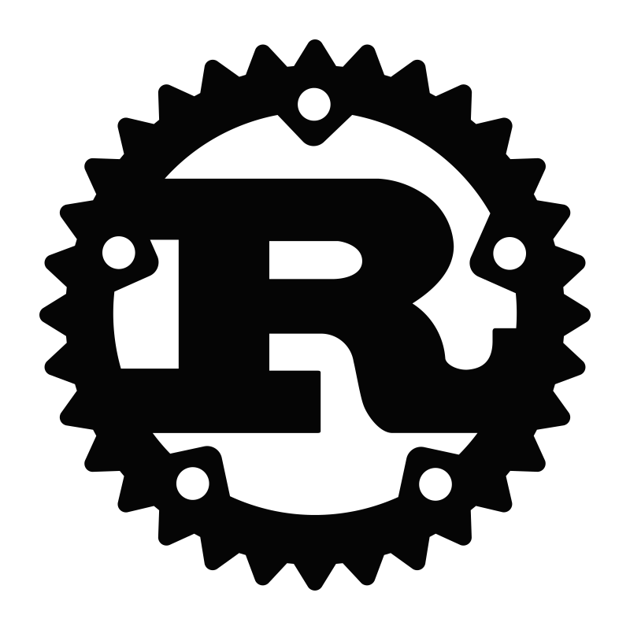

# yondav

[](https://www.yondav.us)
[](https://www.linkedin.com/in/yondav)
[](mailto:yoni@yondav.us)
[](https://cdn.sanity.io/files/0gd4yjy9/production/2a8d0b7f87273abeac08e2f92b926d83b1322349.pdf)


## Who am I?

```python
  class YonDav:
    family_name = 'David'
    given_name = 'Jonathan'
    nick_name = 'Yoni'
    brand_name = 'yondav'

    location = 'New York City'

    profession = 'Software Engineer'
    employer = {
        'name': 'Kinetic IQ',
        'web': 'https://www.kineticiq.com/'
    }

    technologies = [
        'JavaScript',
        'TypeScript',
        'Python',
        'Bash',
        'Git',
        'Rust',
        'Solidity',
        'AWS',
        'ReactJS',
        'NextJS',
        'Gatsby',
        'CSS',
        'TailwindCSS',
        'NodeJS',
        'ExpressJS',
        'NestJS',
        'Prisma',
        'MongoDB',
        'MySQL',
        'PostgreSQL'
    ]

    interests = ['Audio Engineering', 'Percussion', 'Baseball', 'Cooking', 'Travel']

    def format_interests(self):
        formatted_interests = ""
        for interest in self.interests:
            formatted_interests += f"- {interest}\n"
        return formatted_interests

    def introduction(self):
        interests_list = self.format_interests()
        return f"Hello, I'm {self.given_name} {self.family_name} but you can call me {self.nick_name} or drop the extra syllables and call me {self.brand_name}.\n\nI'm currently living in {self.location} working as a {self.profession} at [{self.employer['name']}]({self.employer['web']}). \n\nOutside of programming, my primary interests are\n{interests_list}"

    def tech_icons(self):
        icons_markdown_list = []
        for tech in self.technologies:
            icon_file_name = tech.lower() + '.svg'
            icon_path = os.path.join('./readme-assets/icons', icon_file_name)
            icon_markdown = f""
            icons_markdown_list.append(icon_markdown)
        return " ".join(icons_markdown_list)
```

```python
  yondav = YonDav()
```

## yondav.introduction()

Hello, I'm Jonathan David but you can call me Yoni or drop the extra syllables and call me yondav.

I'm currently living in New York City and working as a Software Engineer at [Kinetic IQ](https://www.kineticiq.com/).

Outside of programming, my primary interests are

- Audio Engineering
- Percussion
- Baseball
- Cooking
- Travel

## yondav.tech_icons()

 

##


