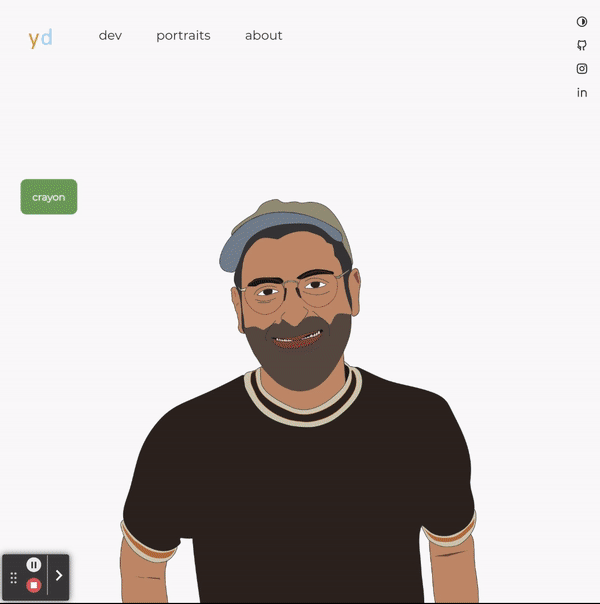

  
  
  
  

 

---

 

I’m Yoni David - Full Stack Developer living in Queens, New York. I create all sorts of stuff on the web.

I have a background in a range industries from music as a performer and audio engineer to real estate as a broker and co-founder of a boutique Brooklyn agency.

I like solving problems and collaborating. My time away from the web is spent with my family, playing music or complaining about the New York Mets. Interested in the entire development spectrum and expanding my understanding of the technologies we use every day.

 

---

 

<a 
  href='https://www.yondav.us/' target='_blank' rel='noopener noreferrer'>
    
    -
  Color Me Yon
  </a>
  

 

  

 

  <a href='https://www.yondav.us/' target='_blank' rel='noopener noreferrer'>
  yondav.us
  </a>
  - an interactive showcase of who I am, what I do and where I come from.

<!--

title_color - Card's title color (hex color)
text_color - Body text color (hex color)
icon_color - Icons color if available (hex color)
border_color - Card's border color (hex color). (Does not apply when hide_border is enabled)
bg_color - Card's background color (hex color) or a gradient in the form of angle,start,end
hide_border - Hides the card's border (boolean)
theme - name of the theme, choose from all available themes
cache_seconds - set the cache header manually (min: 1800, max: 86400)
locale - set the language in the card (e.g. cn, de, es, etc.)
border_radius - Corner rounding on the card_

**yondav/yondav** is a ✨ _special_ ✨ repository because its `README.md` (this file) appears on your GitHub profile.

Here are some ideas to get you started:

- 🔭 I’m currently working on ...
- 🌱 I’m currently learning ...
- 👯 I’m looking to collaborate on ...
- 🤔 I’m looking for help with ...
- 💬 Ask me about ...
- 📫 How to reach me: ...
- 😄 Pronouns: ...
- ⚡ Fun fact: ...
  -->
